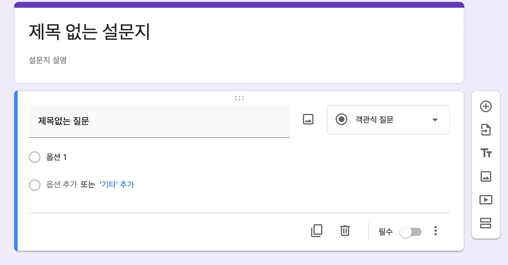
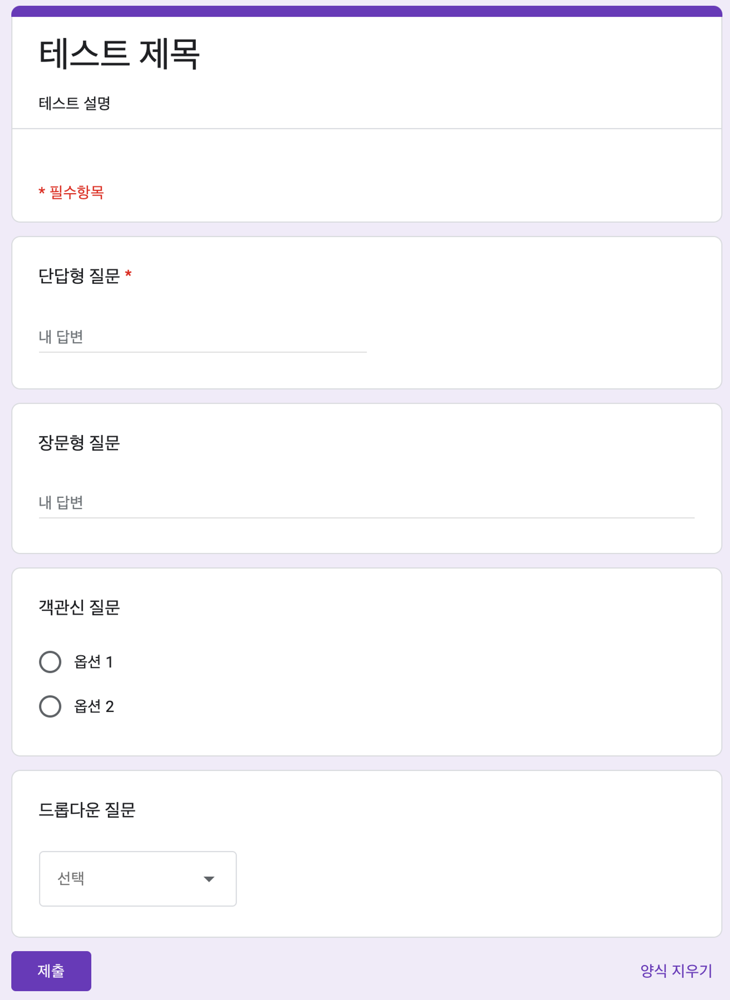

# ✔ 구글 설문조사 만들기

- 목차
  
  - [💁‍♂️ 프로젝트 설명](#-프로젝트-설명)
  - [✨ 완성 결과물](#-완성-결과물)
  - [⚙ 과제 설치 및 실행 방법](#-과제-설치-및-실행-방법)
  - [📃 기능 명세서](#-기능-명세서)
  - [💥 이슈 및 해결 과정](#-이슈-및-해결-과정)
  - [💡 고민한 점 & 배운 점](#-고민한-점--배운-점)
  - [🛠 기술 스택](#-기술-스택)
  - [🧱 Convention](#-convention)
  - [📂 폴더 구조](#-폴더-구조)

## 💁‍♂️ 프로젝트 설명

- React를 사용해 [구글 설문 조사(Google Form)](https://docs.google.com/forms) 페이지를 구현한다.
  
  - 1️⃣ 설문지 제작 페이지
  - 2️⃣ 설문지 미리보기 페이지
  - 3️⃣ 설문지 제출 완료 페이지 (자유 형식)
  
  
  
  

## ✨ 완성 결과물

## ⚙ 과제 설치 및 실행 방법

## 📃 기능 명세서

### 🔹 설문지 편집 페이지

| 기능                    | 우선순위 | 특징                                                                                                                                                                                                                                                                                                                                                                                                                                                                                                                                                                                                                              | 진행 여부 |
|:---------------------:|:----:|:------------------------------------------------------------------------------------------------------------------------------------------------------------------------------------------------------------------------------------------------------------------------------------------------------------------------------------------------------------------------------------------------------------------------------------------------------------------------------------------------------------------------------------------------------------------------------------------------------------------------------- |:-----:|
| 박스  (제목 박스/질문 박스) | 1    | - 제목 박스나 질문 박스를 클릭하면, 왼쪽에 세로로 파란 줄이 뜨면서 선택되었음을 표시하게 됨 - 질문 박스를 클릭하면, 화면에 보이지 않던 select와 하단 utils(복사, 삭제, 필수 토글 등)가 나타나게 됨 - 설문지 편집 페이지에서는 제목 박스이든 질문 박스이든 하나의 박스만 활성화됨                                                                                                                                                                                                                                                                                                                                                                                                                                                  | X     |
| 설문지 제목                | 1    | - 처음에는 '제목 없는 설문지' 텍스트가 보임 - 이 부분을 클릭하면, 아래 보라색 줄이 생기게 되고 focus가 되면서 수정 가능하게 됨                                                                                                                                                                                                                                                                                                                                                                                                                                                                                                                                              | X     |
| 설문지 설명                | 1    | - 처음에는 '설문지 설명' 텍스트가 보임 - 이 부분을 클릭하면, 아래 보라색 줄이 생기게 되고 focus가 되면서 수정 가능하게 됨                                                                                                                                                                                                                                                                                                                                                                                                                                                                                                                                                 | X     |
| 질문 제목                 | 1    | - 처음에는 '제목없는 질문' 텍스트가 보임 - 이 부분을 클릭하면, 아래 보라색 줄이 생기게 되고 focus가 되면서 수정 가능하게 됨                                                                                                                                                                                                                                                                                                                                                                                                                                                                                                                                            | X     |
| 질문 유형 드롭다운            | 1    | - 드롭다운의 기본값: '객관식 질문' - options 종류: 단답형, 장문형, 객관식 질문, 체크박스, 드롭다운                                                                                                                                                                                                                                                                                                                                                                                                                                                                                                                                                            | X     |
| 질문 본문                 | 1    | - 드롭다운을 변경할 때마다, 질문 본문 부분이 변경됨 1️⃣ 단답형   👉 박스 너비 절반 정도 크기의 입력란이 나타남 👉 입력란은 disabled 상태여서 클릭해도 focus되지 않음 👉 처음에는 '단답형 텍스트' 텍스트가 보임 2️⃣ 장문형 👉 박스 너비 정도 크기의 입력란이 나타남 👉 입력란은 disabled 상태여서 클릭해도 focus되지 않음 👉 처음에는 '장문형 텍스트' 텍스트가 보임 3️⃣ 객관식 질문 👉 각 옵션 앞에 라디오 버튼이 뜨고 disabled 상태여서 클릭해도 체크되지 않음 👉 옵션을 클릭하면 아래 보라색 줄이 생기게 되고 focus가 되면서 수정 가능하게 됨 👉 초기 option 명은 옵션 + '순번' 👉 옵션 추가 텍스트를 클릭하면 옵션이 추가됨 👉 기타 추가 텍스트를 클릭하면 disabled 상태의 입력란이 추가됨 (우선 순위: 3)  👉 각 옵션 우측에 삭제 아이콘을 클릭하면 옵션 삭제 가능 4️⃣ 체크박스 👉 객관식 질문일 때와 유사 5️⃣ 드롭다운 👉 객관식 질문일 때와 유사 | X     |
| 질문 복사                 | 1    | - 질문 복사 아이콘을 클릭하면, 바로 아래에 동일한 질문 박스가 생성됨 - 방금 새로 생성된 박스의 왼쪽에 세로로 파란 줄이 뜨면서 활성화됨                                                                                                                                                                                                                                                                                                                                                                                                                                                                                                                                             | X     |
| 질문 삭제                 | 1    | - 삭제 아이콘을 클릭하면, 해당 질문 박스가 삭제됨 - 화면 왼쪽 아래에 '항목이 삭제되었습니다.' 메시지를 포함한 알림이 뜨게 됨  - 삭제된 박스 위에 박스가 있다면 위 박스가 활성화되고, 없다면 아래 박스가 활성화 됨. 둘 다 없다면 제목 박스가 활성화 됨                                                                                                                                                                                                                                                                                                                                                                                                                                                                     | X     |
| 필수 옵션 설정              | 1    | - '필수' 텍스트나 토글 버튼을 클릭하게 되면 토글이 됨                                                                                                                                                                                                                                                                                                                                                                                                                                                                                                                                                                                                | X     |
| 질문 추가                 | 1    | - 질문 박스들 우측에 추가 아이콘을 담은 박스가 있음 - 사용자가 스크롤하면 이 박스가 같이 따라오게 됨 - 추가 아이콘을 클릭하면, 현재 활성화된 박스 바로 아래에 새 질문 박스가 생성되고 활성화 됨                                                                                                                                                                                                                                                                                                                                                                                                                                                                                                   | X     |
| 미리보기 이동 버튼            | 1    | - 페이지 우측 하단에 화면에 고정된 미리보기 이동 버튼이 있음 - 버튼을 클릭하게 되면, 미리보기 페이지가 렌더링됨                                                                                                                                                                                                                                                                                                                                                                                                                                                                                                                                                           | X     |
| 새로고침 시, 데이터 유지        | 2    | - 새로고침해도 제목과 질문 데이터가 그대로 유지됨                                                                                                                                                                                                                                                                                                                                                                                                                                                                                                                                                                                                    | X     |
| 질문 순서 변경              | 1    | - 질문 박스 상단에 이동 아이콘이 있음 - 아이콘을 Drag & Drop하면 질문 순서를 변경할 수 있음                                                                                                                                                                                                                                                                                                                                                                                                                                                                                                                                                                 | X     |
| 질문 옵션 순서 변경           | 1    | - 질문 유형이 객관식 질문/체크 박스/드롭박스인 경우, 각 옵션 왼쪽에 이동 아이콘이 있음 - 아이콘을 Drag & Drop을 하면 옵션 순서를 변경할 수 있음                                                                                                                                                                                                                                                                                                                                                                                                                                                                                                                                  | X     |

### 🔹 설문지 미리보기 페이지

| 기능           | 우선순위 | 특징                                                                                                                                                                                                                                                                                                                                                                                                                                                                   | 진행여부 |
|:------------:|:----:| -------------------------------------------------------------------------------------------------------------------------------------------------------------------------------------------------------------------------------------------------------------------------------------------------------------------------------------------------------------------------------------------------------------------------------------------------------------------- |:----:|
| 설문지 편집 이동 버튼 | 1    | - 페이지 우측 하단에 화면에 고정된 설문지 편집 이동 버튼이 있음 - 버튼을 클릭하게 되면, 설문지 편집 페이지가 렌더링됨                                                                                                                                                                                                                                                                                                                                                                                            | X    |
| 질문 박스        | 1    | 1️⃣ 단답형  👉 박스 너비 절반 정도 크기의 입력란이 나타남 👉 입력란을 클릭하면, 아래 보라색 줄이 생기게 되고 focus가 되면서 작성 가능하게 됨 👉 처음에는 '내 답변' 텍스트가 보임 2️⃣ 장문형 👉 박스 너비 크기의 입력란이 나타남 👉 입력란을 클릭하면, 아래 보라색 줄이 생기게 되고 focus가 되면서 작성 가능하게 됨 👉 처음에는 '내 답변' 텍스트가 보임 3️⃣ 객관식 질문 👉 각 옵션 앞에 라디오 버튼이 뜨고 하나의 옵션만 선택 가능함 👉 기타 옵션에는 입력란이 존재해 사용자가 옵션을 직접 작성 가능함 (우선 순위: 3)  4️⃣ 체크박스 👉 각 옵션 앞에 체크박스 버튼이 뜨고 여러 옵션을 선택 가능함 5️⃣ 드롭다운 👉 드롭다운을 선택해 하나의 옵션 선택 가능 | X    |
| 제출 버튼        | 1    | - 설문지 좌측 하단에 제출 버튼 존재 - 제출 버튼 클릭시, 설문지 제출 완료 페이지가 렌더링됨 - 필수 질문 미작성 시, 제출 완료 페이지로 이동되지 않음 - 미작성된 필수 질문 박스들의 테두리가 빨간색으로 변경되고 박스 내 아래 부분에 '필수 질문입니다.' 텍스트가 뜸                                                                                                                                                                                                                                                                                                | X    |
| 양식 지우기 기능    | 2    | - 설문지 우측 하단에 양식 지우기 버튼 존재 - 양식 지우기 버튼 클릭 시, 모달창이 뜨고 양식 삭제 여부를 한번 더 확인함 - 최종적으로 양식 지우기 클릭 시, 모든 질문 박스 내 답변이 삭제됨                                                                                                                                                                                                                                                                                                                                               | X    |

### 🔹 설문지 제출 완료 페이지

| 기능           | 우선순위 | 특징                                                                                             | 진행여부 |
|:------------:|:----:| ---------------------------------------------------------------------------------------------- |:----:|
| 설문지 편집 이동 버튼 | 1    | - 페이지 우측 하단에 화면에 고정된 설문지 편집 이동 버튼이 있음 - 버튼을 클릭하게 되면, 설문지 편집 페이지가 렌더링됨                      | X    |
| 질문 박스        | 1    | - 각 질문 박스에서는 질문과 내 답변 결과를 확인할 수 있음 - 설문지 미리보기 페이지와 유사하게 표시되어 있으나, 클릭 시 focuse되거나 값이 변하지 않음 | X    |
| 다른 응답 제출     | 3    | - 설문지 우측 하단에 다른 응답 제출 버튼이 있음 - 이 버튼 클릭 시, 설문지 미리보기 페이지로 이동하고 이전에 작성한 답변들은 모두 삭제됨           | X    |

## 💥 이슈 및 해결 과정

## 💡 고민한 점 & 배운 점

### 🔹 Single Page Application

이 프로젝트에서는 설문지 편집 페이지, 설문지 미리보기 페이지, 설문지 제출 완료 페이지 이렇게 총 3개의 페이지를 구현해야 했다.

기존 구글폼은 설문지 편집 페이지에서 '👁 미리보기' 버튼을 클릭하면 새 탭이 열린 후 설문지를 보여주게 된다. 처음엔 나도 이처럼 미리보기 페이지를 새 탭에서 보여줘야 겠다고 생각했었다.  
그러다 내가 사용자라면 설문지 편집 페이지와 설문지 미리보기 페이지를 따로 두는 것보단, 설문지 편집 페이지에서 '👁 미리보기' 버튼을 클릭했을 때 그 페이지에서 바로 미리보기 결과를 확인을 하고 '✍ 설문지 편집하기' 버튼을 클릭하면 설문지 편집 페이지로 돌아가게끔 하는 것이 더 좋은 UX를 제공하지 않을까 생각했다.

따라서, `React-Router`를 사용해 구글폼을 Single Page Application으로 구현하기로 결정했다.

## 🛠 기술 스택

- Language: `TypeScript`
- UI: `React`
- Client-side Routing: `React-Router`
- Client-State 관리: `Redux`, `Redux-Toolkit`
- Style: `Emotion`
- React 개발 환경: `Vite`
- Package Manager: `yarn`
- Version Control System: `Git`

## 🧱 Convention

### 🔹 Commit Convention

- Commit 은 가급적이면 기능 당 하나의 커밋을 사용한다.

- master 브랜치에 바로 commit 하지 않는다.

- Commit Message 작성 시, 앞부분에 type를 기입한다.
  
  | type     | 설명                               |
  | -------- | -------------------------------- |
  | Feat     | 새로운 기능을 추가할 경우                   |
  | Fix      | 버그를 고친 경우                        |
  | Design   | CSS 등 사용자 UI 디자인 변경              |
  | Style    | 코드 포맷 변경, 세미 콜론 누락, 코드 수정이 없는 경우 |
  | Refactor | 코드 리팩터링                          |
  | Comment  | 필요한 주석 추가 및 변경                   |
  | Docs     | 문서를 수정한 경우                       |
  | Chore    | 패키지 매니저를 설정하는 경우                 |
  | Env      | 프로젝트 환경 설정                       |
  | Init     | 프로젝트 첫 설정                        |
  | Rename   | 파일 혹은 폴더명을 수정했거나 옮기는 작업을 한 경우    |
  | Remove   | 파일을 삭제하는 작업을 한 경우                |
  | Asset    | asset 관련 파일 업데이트 작업을 수행한 경우      |

### 🔹 Git Branch Convention

- master 브랜치: 항상 최신의 상태를 담고 있는 브랜치
  
  - 새로운 브랜치는 항상 master 브랜치에서 만든다.
  - docs 작업은 master 브랜치에 바로 commit 한다.

- feature 브랜치: docs를 제외한 모든 작업(기능, 디자인, 버그, 리팩토링 등)을 하는 브랜치
  
  - feature 브랜치명은 어떤 일을 하고 있는지에 대해서 자세하게 작성한다.
    
    - `[type 명]/[작업 설명]`
    - ex) Feat/survey-title-box
  
  - feature 브랜치는 master 브랜치에 merge 후 로컬에서 바로 지운다.

## 📂 폴더 구조
