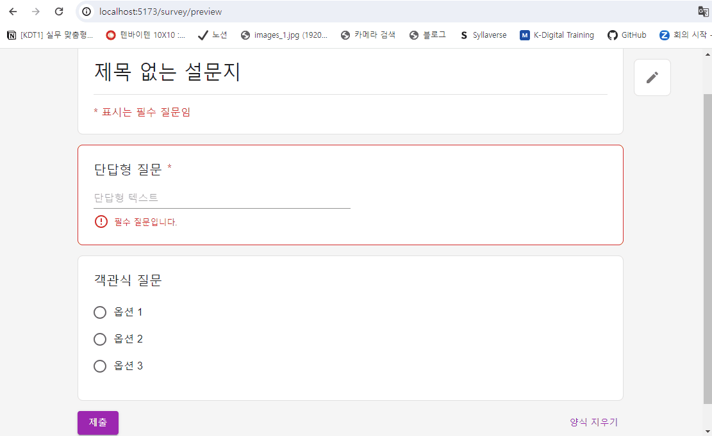
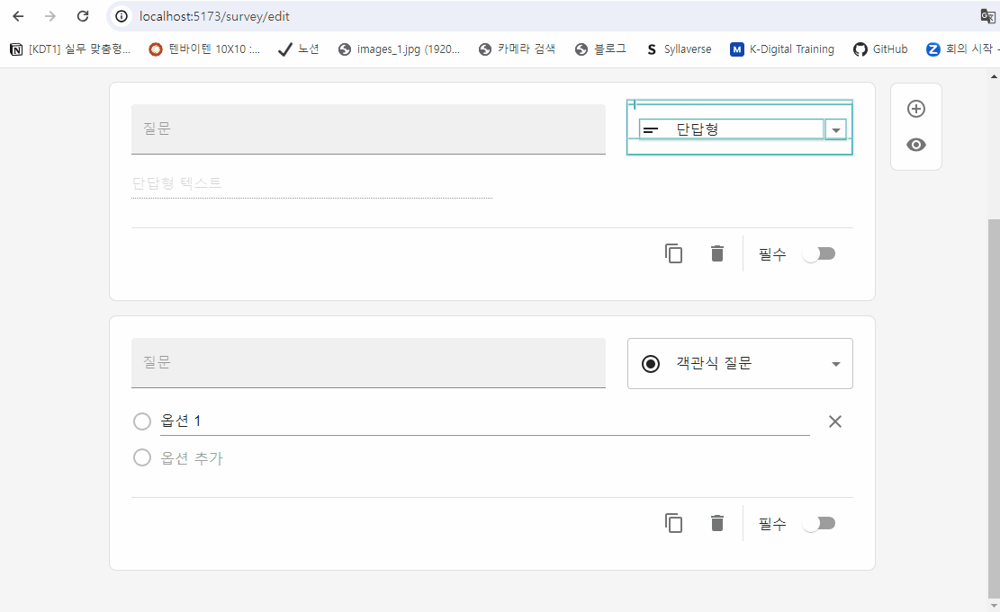
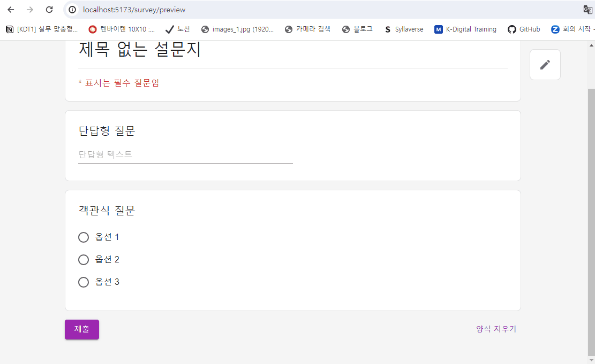

# ✔ 구글 설문조사 만들기

- 목차

  - [💁‍♂️ 프로젝트 설명](#-프로젝트-설명)
  - [✨ 완성 결과물](#-완성-결과물)
  - [⚙ 과제 설치 및 실행 방법](#-과제-설치-및-실행-방법)
  - [📃 기능 명세서](#-기능-명세서)
  - [💥 이슈 및 해결 과정](#-이슈-및-해결-과정)
  - [💡 고민한 점 & 배운 점](#-고민한-점--배운-점)
  - [🛠 기술 스택](#-기술-스택)
  - [🧱 Convention](#-convention)
  - [📂 폴더 구조](#-폴더-구조)

## 💁‍♂️ 프로젝트 설명

- React를 사용해 [구글 설문 조사(Google Form)](https://docs.google.com/forms) 페이지를 구현한다.

  - 1️⃣ 설문지 제작 페이지
  - 2️⃣ 설문지 미리보기 페이지
  - 3️⃣ 설문지 제출 완료 페이지 (자유 형식)

  

  

## ✨ 완성 결과물

## ⚙ 과제 설치 및 실행 방법

- `package.json` 내 모든 패키지 설치하기

  ```bash
  $ cd classum-survey
  $ yarn install
  ```

- 프로젝트 실행하기

  ```bash
  $ cd classum-survey
  $ yarn dev
  ```

## 📃 기능 명세서

### 🔹 설문지 편집 페이지

|              기능               | 우선순위 | 특징                                                                                                                                                                                                                                                                                                                                                                                                                                                                                                                                                                                                                                                                                                                                                                                                                                                                                                                        | 진행 여부 |
| :-----------------------------: | :------: | :-------------------------------------------------------------------------------------------------------------------------------------------------------------------------------------------------------------------------------------------------------------------------------------------------------------------------------------------------------------------------------------------------------------------------------------------------------------------------------------------------------------------------------------------------------------------------------------------------------------------------------------------------------------------------------------------------------------------------------------------------------------------------------------------------------------------------------------------------------------------------------------------------------------------------- | :-------: |
| 박스 <br/>(제목 박스/질문 박스) |    1     | - 제목 박스나 질문 박스를 클릭하면, 왼쪽에 세로로 파란 줄이 뜨면서 선택되었음을 표시하게 됨<br/>- 질문 박스를 클릭하면, 화면에 보이지 않던 select와 하단 utils(복사, 삭제, 필수 토글 등)가 나타나게 됨<br/>- 설문지 편집 페이지에서는 제목 박스이든 질문 박스이든 하나의 박스만 활성화됨                                                                                                                                                                                                                                                                                                                                                                                                                                                                                                                                                                                                                                    |     △     |
|           설문지 제목           |    1     | - 처음에는 '제목 없는 설문지' 텍스트가 보임<br/>- 이 부분을 클릭하면, 아래 보라색 줄이 생기게 되고 focus가 되면서 수정 가능하게 됨                                                                                                                                                                                                                                                                                                                                                                                                                                                                                                                                                                                                                                                                                                                                                                                          |     O     |
|           설문지 설명           |    1     | - 처음에는 '설문지 설명' 텍스트가 보임<br/>- 이 부분을 클릭하면, 아래 보라색 줄이 생기게 되고 focus가 되면서 수정 가능하게 됨                                                                                                                                                                                                                                                                                                                                                                                                                                                                                                                                                                                                                                                                                                                                                                                               |     O     |
|            질문 제목            |    1     | - 처음에는 '제목없는 질문' 텍스트가 보임<br/>- 이 부분을 클릭하면, 아래 보라색 줄이 생기게 되고 focus가 되면서 수정 가능하게 됨<br/>                                                                                                                                                                                                                                                                                                                                                                                                                                                                                                                                                                                                                                                                                                                                                                                        |     O     |
|       질문 유형 드롭다운        |    1     | - 드롭다운의 기본값: '객관식 질문'<br/>- options 종류: 단답형, 장문형, 객관식 질문, 체크박스, 드롭다운                                                                                                                                                                                                                                                                                                                                                                                                                                                                                                                                                                                                                                                                                                                                                                                                                      |     O     |
|            질문 본문            |    1     | - 드롭다운을 변경할 때마다, 질문 본문 부분이 변경됨<br/>1️⃣ 단답형 <br/> 👉 박스 너비 절반 정도 크기의 입력란이 나타남<br/>👉 입력란은 disabled 상태여서 클릭해도 focus되지 않음<br/>👉 처음에는 '단답형 텍스트' 텍스트가 보임<br/>2️⃣ 장문형<br/>👉 박스 너비 정도 크기의 입력란이 나타남<br/>👉 입력란은 disabled 상태여서 클릭해도 focus되지 않음<br/>👉 처음에는 '장문형 텍스트' 텍스트가 보임<br/>3️⃣ 객관식 질문<br/>👉 각 옵션 앞에 라디오 버튼이 뜨고 disabled 상태여서 클릭해도 체크되지 않음<br/>👉 옵션을 클릭하면 아래 보라색 줄이 생기게 되고 focus가 되면서 수정 가능하게 됨<br/>👉 초기 option 명은 옵션 + '순번'<br/>👉 옵션 추가 텍스트를 클릭하면 옵션이 추가됨<br/>👉 기타 추가 텍스트를 클릭하면 disabled 상태의 입력란이 추가됨 (우선 순위: 3) <br/>👉 각 옵션 우측에 삭제 아이콘을 클릭하면 옵션 삭제 가능<br/>4️⃣ 체크박스<br/>👉 객관식 질문일 때와 유사<br/>5️⃣ 드롭다운<br/>👉 객관식 질문일 때와 유사 |     △     |
|            질문 복사            |    1     | - 질문 복사 아이콘을 클릭하면, 바로 아래에 동일한 질문 박스가 생성됨<br/>- 방금 새로 생성된 박스의 왼쪽에 세로로 파란 줄이 뜨면서 활성화됨                                                                                                                                                                                                                                                                                                                                                                                                                                                                                                                                                                                                                                                                                                                                                                                  |     △     |
|            질문 삭제            |    1     | - 삭제 아이콘을 클릭하면, 해당 질문 박스가 삭제됨<br/>- 화면 왼쪽 아래에 '항목이 삭제되었습니다.' 메시지를 포함한 알림이 뜨게 됨 <br/>- 삭제된 박스 위에 박스가 있다면 위 박스가 활성화되고, 없다면 아래 박스가 활성화 됨. 둘 다 없다면 제목 박스가 활성화 됨                                                                                                                                                                                                                                                                                                                                                                                                                                                                                                                                                                                                                                                               |     △     |
|         필수 옵션 설정          |    1     | - '필수' 텍스트나 토글 버튼을 클릭하게 되면 토글이 됨                                                                                                                                                                                                                                                                                                                                                                                                                                                                                                                                                                                                                                                                                                                                                                                                                                                                       |     O     |
|            질문 추가            |    1     | - 질문 박스들 우측에 추가 아이콘을 담은 박스가 있음<br/>- 사용자가 스크롤하면 이 박스가 같이 따라오게 됨<br/>- 추가 아이콘을 클릭하면, 현재 활성화된 박스 바로 아래에 새 질문 박스가 생성되고 활성화 됨<br/>                                                                                                                                                                                                                                                                                                                                                                                                                                                                                                                                                                                                                                                                                                                |     △     |
|       미리보기 이동 버튼        |    1     | - 페이지 우측 하단에 화면에 고정된 미리보기 이동 버튼이 있음<br/>- 버튼을 클릭하게 되면, 미리보기 페이지가 렌더링됨                                                                                                                                                                                                                                                                                                                                                                                                                                                                                                                                                                                                                                                                                                                                                                                                         |     O     |
|    새로고침 시, 데이터 유지     |    2     | - 새로고침해도 제목과 질문 데이터가 그대로 유지됨                                                                                                                                                                                                                                                                                                                                                                                                                                                                                                                                                                                                                                                                                                                                                                                                                                                                           |     O     |
|         질문 순서 변경          |    1     | - 질문 박스 상단에 이동 아이콘이 있음<br/>- 아이콘을 Drag & Drop하면 질문 순서를 변경할 수 있음                                                                                                                                                                                                                                                                                                                                                                                                                                                                                                                                                                                                                                                                                                                                                                                                                             |     O     |
|       질문 옵션 순서 변경       |    1     | - 질문 유형이 객관식 질문/체크 박스/드롭박스인 경우, 각 옵션 왼쪽에 이동 아이콘이 있음<br/>- 아이콘을 Drag & Drop을 하면 옵션 순서를 변경할 수 있음                                                                                                                                                                                                                                                                                                                                                                                                                                                                                                                                                                                                                                                                                                                                                                         |     O     |

### 🔹 설문지 미리보기 페이지

|         기능          | 우선순위 | 특징                                                                                                                                                                                                                                                                                                                                                                                                                                                                                                                                                                                                                                                                                                       | 진행여부 |
| :-------------------: | :------: | ---------------------------------------------------------------------------------------------------------------------------------------------------------------------------------------------------------------------------------------------------------------------------------------------------------------------------------------------------------------------------------------------------------------------------------------------------------------------------------------------------------------------------------------------------------------------------------------------------------------------------------------------------------------------------------------------------------- | :------: |
| 설문지 편집 이동 버튼 |    1     | - 페이지 우측 하단에 화면에 고정된 설문지 편집 이동 버튼이 있음<br/>- 버튼을 클릭하게 되면, 설문지 편집 페이지가 렌더링됨                                                                                                                                                                                                                                                                                                                                                                                                                                                                                                                                                                                  |    O     |
|       질문 박스       |    1     | 1️⃣ 단답형 <br/>👉 박스 너비 절반 정도 크기의 입력란이 나타남<br/>👉 입력란을 클릭하면, 아래 보라색 줄이 생기게 되고 focus가 되면서 작성 가능하게 됨<br/>👉 처음에는 '내 답변' 텍스트가 보임<br/>2️⃣ 장문형<br/>👉 박스 너비 크기의 입력란이 나타남<br/>👉 입력란을 클릭하면, 아래 보라색 줄이 생기게 되고 focus가 되면서 작성 가능하게 됨<br/>👉 처음에는 '내 답변' 텍스트가 보임<br/>3️⃣ 객관식 질문<br/>👉 각 옵션 앞에 라디오 버튼이 뜨고 하나의 옵션만 선택 가능함<br/>👉 기타 옵션에는 입력란이 존재해 사용자가 옵션을 직접 작성 가능함 (우선 순위: 3) <br/>4️⃣ 체크박스<br/>👉 각 옵션 앞에 체크박스 버튼이 뜨고 여러 옵션을 선택 가능함<br/>5️⃣ 드롭다운<br/>👉 드롭다운을 선택해 하나의 옵션 선택 가능 |    △     |
|       제출 버튼       |    1     | - 설문지 좌측 하단에 제출 버튼 존재<br/>- 제출 버튼 클릭시, 설문지 제출 완료 페이지가 렌더링됨<br/>- 필수 질문 미작성 시, 제출 완료 페이지로 이동되지 않음<br/>- 미작성된 필수 질문 박스들의 테두리가 빨간색으로 변경되고 박스 내 아래 부분에 '필수 질문입니다.' 텍스트가 뜸                                                                                                                                                                                                                                                                                                                                                                                                                               |    O     |
|   양식 지우기 기능    |    2     | - 설문지 우측 하단에 양식 지우기 버튼 존재<br/>- 양식 지우기 버튼 클릭 시, 모달창이 뜨고 양식 삭제 여부를 한번 더 확인함<br/>- 최종적으로 양식 지우기 클릭 시, 모든 질문 박스 내 답변이 삭제됨                                                                                                                                                                                                                                                                                                                                                                                                                                                                                                             |    O     |

### 🔹 설문지 제출 완료 페이지

|         기능          | 우선순위 | 특징                                                                                                                                                     | 진행여부 |
| :-------------------: | :------: | -------------------------------------------------------------------------------------------------------------------------------------------------------- | :------: |
| 설문지 편집 이동 버튼 |    1     | - 페이지 우측 하단에 화면에 고정된 설문지 편집 이동 버튼이 있음<br/>- 버튼을 클릭하게 되면, 설문지 편집 페이지가 렌더링됨                                |    O     |
|       질문 박스       |    1     | - 각 질문 박스에서는 질문과 내 답변 결과를 확인할 수 있음<br/>- 설문지 미리보기 페이지와 유사하게 표시되어 있으나, 클릭 시 focuse되거나 값이 변하지 않음 |    O     |
|    되돌아가기 버튼    |    3     | - 설문지 좌측 하단에 되돌아가기 버튼이 있음<br/>- 이 버튼 클릭 시, 설문지 미리보기 페이지로 이동                                                         |    O     |

## 💥 이슈 및 해결 과정

### 🔹 SurveyEditPageTitleBox 내 제목 입력창에 값 하나 입력할 때마다 outfocusing 되는 문제

설문조사 수정 페이지에서 설문조사 제목 박스 내 제목 입력창에 값을 하나 입력할 때마다 아웃포커싱되는 이슈가 발생했다.

아래 SurveyEditPageQuestionBox 내 입력창에 값을 입력할 때는 이러한 아웃포커싱 문제가 발생하지 않았는데, 대체 왜 SurveyEditPageTitleBox에선 이런 이슈가 발생한 걸까..? 그 이유를 알기 위해 SurveyEditPageQuestionBox와 SurveyEditPageTitleBox의 차이점을 파악하고자 했다.

일단, 두 컴포넌트의 첫 번째 차이점은 SurveyEditPageQuestionBox의 경우 redux store의 state 값을 props로 받는 반면, SurveyEditPageTitleBox의 경우 이 컴포넌트 내에서 useSelector 훅을 통해 바로 redux store의 state 값을 받게 된다. 하지만, props가 변경되어 리렌더링되나 useSelector에 의해 리렌더링되나 리액트는 어차피 변경된 가상돔 요소만 실제돔에 반영하기 때문에, 이러한 이유로 아웃포커싱되는 이슈가 발생할 것 같진 않았다.

혹시 SurveyEditPageTitleBox에서 제목 입력창에 값을 입력할 때마다 기존 컴포넌트가 리렌더링되는게 아니라 새로운 컴포넌트가 만들어지는건 아닐까싶어 개발자 검사 도구의 element 탭 부분을 확인해보았다. 확인한 결과, 아래처럼 제목 입력창에 값을 입력할 때마다 SurveyEditPageTitleBox의 div 요소에 보라색 배경이 생기면서 새로 생성됨을 알 수 있었다.

 </br >
👉 SurveyEditPageQuestionBox의 title 입력창을 수정하는 경우

 </br >
👉 SurveyEditPageTitleBox의 title 입력창을 수정하는 경우

대체 왜 두 컴포넌트가 이러한 차이를 보이는 걸까? SurveyEditPageTitleBox가 렌더링하는 요소 중 하위 요소를 감싸는 SurveyTitleBox 컴포넌트를 주목하게 되었다. SurveyTitleBox 컴포넌트를 보면 컴포넌트 내 `styled(Box)`를 통해 emotion으로 새로운 컴포넌트를 만들어주는 것을 확인할 수 있었다. 혹시, SurveyTitleBox가 리렌더링될 때마다 `styled(Box)`을 호출해 새로운 컴포넌트를 만들게 되고 이로 인해 SurveyTitleBox를 사용하고 있는 SurveyEditPageTitleBox가 리렌더링될 때마다 새로운 돔요소가 만들어지고 있는 걸까라는 의심이 들었다.

그래서 한번 `styled(Box)` 코드를 SurveyTitleBox 컴포넌트 밖으로 꺼내본 후, 제목 입력창에 값을 입력해보았다. 그랬더니 아웃포커싱되는 이슈가 없어지는 것을 확인할 수 있었다. 이러한 이유였다니... 허망한 감정과 동시에 드디어 해결했다는 뿌듯함이 밀려왔다.

내가 생각한 이유가 맞는지 한번 더 확인하기 위해, 이번엔 `styled(Box)` 코드를 SurveyTitleBox 컴포넌트 밖으로 꺼내지 않고 아래처럼 `useMemo`를 사용해 `styled(Box)` 코드를 감싸 이전 컴포넌트를 기억하도록 했다. 이 방법 또한 아웃포커싱되는 이슈를 해결해주었다.

```js
function SurveyTitleBox({ children }: SurveyTitleBoxProps) {
  const theme = useTheme();

  const StyledBox = useMemo(
    () => styled(Box)`
      position: relative;
      padding-top: ${BOX_PADDING * DEFAULT_PADDING_UNIT + BAR_HEIGHT}px;

      &::before {
        content: "";
        display: block;
        position: absolute;
        top: 0;
        left: 0;
        width: 100%;
        height: ${BAR_HEIGHT}px;
        border-radius: ${BAR_BORDER_RADIUS}px ${BAR_BORDER_RADIUS}px 0 0;
        background-color: ${theme.palette.secondary.main};
      }
    `,
    []
  );

  return <StyledBox>{children}</StyledBox>;
}
```

### 🔹 Debouncing

> 참고: [리액트 디바운싱](https://velog.io/@tjdud0123/%EB%A6%AC%EC%95%A1%ED%8A%B8-%EB%94%94%EB%B0%94%EC%9A%B4%EC%8B%B1-%EA%B0%84%EB%8B%A8-%EA%B5%AC%ED%98%84-react-debounce)<br />
> 참고: [리덕스 사가 이해하기](https://simsimjae.medium.com/%EB%A6%AC%EB%8D%95%EC%8A%A4-%EC%82%AC%EA%B0%80-%EC%9D%B4%ED%95%B4%ED%95%98%EA%B8%B0-8e573de9786e)<br />
> 참고: [리덕스 사가로 디바운스 구현하기](https://github.com/hyejinny97/TIL/blob/master/Redux/redux_saga.md#-%EB%A6%AC%EB%8D%95%EC%8A%A4-%EC%82%AC%EA%B0%80%EB%A1%9C-%EB%94%94%EB%B0%94%EC%9A%B4%EC%8A%A4-%EA%B5%AC%ED%98%84%ED%95%98%EA%B8%B0) <br />
> 참고: [redux-saga takeLatest 함수](https://react.vlpt.us/redux-middleware/10-redux-saga.html)<br />

survey edit page에서 question box의 input 값을 수정할 때마다 redux store로 dispatch를 보낸 후 변경된 state를 다시 받아와 input 태그의 value 값으로 두었다. 만약 이 상황에서 빠르게 글자를 입력하게 된다면 연이어 redux store로 dispatch를 보내게 되는데, 변경된 state가 input 태그의 value 값으로 전달되는 속도보다 입력 속도가 빠르다보니 화면에 변화가 느리게 반영되는 이슈가 발생했다.

```js
import { updateSurveyTitle } from "@stores";

function SurveyEditPageTitleBox() {
  const surveyTitle = useSelector(
    (state: RootState) => state.survey.surveyTitle
  );
  const dispatch = useDispatch();

  const handleSurveyTitleChange = (e: React.ChangeEvent<HTMLInputElement>) => {
    dispatch(updateSurveyTitle(e.target.value));
  };

  return (
    <SurveyTitleBox>
      <TextField
        value={surveyTitle}
        onChange={handleSurveyTitleChange}
        variant="standard"
        fullWidth
        InputProps={{ sx: { fontSize: TITLE_BOX_TITLE_FONT_SIZE } }}
      />
    </SurveyTitleBox>
  );
}

export default SurveyEditPageTitleBox;
```

이를 해결하기 위해, 차라리 input 값을 redux store로 관리하는 것보다 컴포넌트 내에서 `useState()`를 사용해 로컬로 관리해야겠다고 생각했다. 그리고, 이 입력값이 다른 컴포넌트에서도 사용되어야하기 때문에 전역 상태로 관리해야할 필요가 있어서 반드시 redux store에도 저장해야 했다. 따라서, input 태그에서 change event가 일어날 때 실행시킬 handler function 내부에서 setter function을 실행시켜주어 로컬 state를 변경시켜 줄뿐만 아니라 redux store로 dispatch를 보내게 수정했다.

```js
function SurveyEditPageTitleBox() {
  const initialSurveyTitle = useSelector(
    (state: RootState) => state.survey.surveyTitle
  );
  const [surveyTitleText, setSurveyTitleText] = useState(initialSurveyTitle);
  const dispatch = useDispatch();

  const handleSurveyTitleChange = (e: React.ChangeEvent<HTMLInputElement>) => {
    dispatch(updateSurveyTitle(e.target.value));
    setSurveyTitleText(e.target.value);
  };

  return (
    <SurveyTitleBox>
      <TextField
        value={surveyTitleText}
        onChange={handleSurveyTitleChange}
        variant="standard"
        fullWidth
        InputProps={{ sx: { fontSize: TITLE_BOX_TITLE_FONT_SIZE } }}
      />
    </SurveyTitleBox>
  );
}
```

이제, 입력란에 빠르게 글자를 입력했을 때 화면에 바로 반영되는 것을 확인할 수 있었다. 하지만, 여전히 redux store에 불필요하게 많은 dispatch를 보내어 reducer를 실행시키고 있었다. 이를 해결하기 위해서, Debounce 개념을 떠올리게 되었고 이를 적용하기 위해 `redux-saga` 라이브러리를 사용하게 되었다.

```js
// stores/actions/surveyActions.ts
import { createAction } from "@reduxjs/toolkit";
import { surveySlice } from "../slices";

const stateName = surveySlice.name;

const tryUpdateSurveyTitle =
  createAction < string > `${stateName}/tryUpdateSurveyTitle`;
```

```js
// stores/sagas/surveySaga.ts
import { debounce, put } from "redux-saga/effects";

function* tryUpdateSurveyTitleSaga(action: PayloadAction<string>) {
  yield put(updateSurveyTitle(action.payload));
}

export function* surveySaga() {
  yield debounce(1000, tryUpdateSurveyTitle, tryUpdateSurveyTitleSaga);
}
```

```js
function SurveyEditPageTitleBox() {
  // ...
  const handleSurveyTitleChange = (e: React.ChangeEvent<HTMLInputElement>) => {
    dispatch(tryUpdateSurveyTitle(e.target.value)); // updateSurveyTitle → tryUpdateSurveyTitle로 변경
    setSurveyTitleText(e.target.value);
  };
  // ...
}
```

위에서처럼, 'tryUpdateSurveyTitle'이라는 action creator function을 새로 만들고 이 함수의 호출을 감지하는 surveySaga를 만들었다. `debounce()` 함수에 의해 'tryUpdateSurveyTitle'이 연속으로 호출되는 경우 마지막 호출이 진행된지 1초가 지났을 때 비로소 'tryUpdateSurveyTitleSaga'가 실행되게 된다. 'tryUpdateSurveyTitleSaga' 내부에서는 'updateSurveyTitle' action을 redux store로 dispatch하도록 했다.

이로 인해, 불필요하게 redux store로 dispatch를 보내는 것을 방지할 수 있었다.

### 🔹 렌더링 성능 개선

> 참고: [`React.memo()` 현명하게 사용하기](https://ui.toast.com/weekly-pick/ko_20190731)

개발자 검사 도구에서 profiler 탭의 'Highlight updates when components render.' 설정을 키면, 특정 question box의 입력창에 값을 입력할 때마다 페이지 내 다른 question box 컴포넌트들이 리렌더링되는 것을 확인할 수 있었다.

 </br >

👉 기존 SurveyEditPageQuestionBox의 입력창에 값을 입력할 경우

 </br >
👉 기존 SurveyPreviewPageQuestionBox의 입력창에 값을 입력할 경우

모든 question box 내 데이터들을 redux store로 관리하다보니 입력값을 변경할 때마다 redux store로 새 입력값을 dispatch 보내게 되고 store 값이 변경되면 해당 state를 사용하는 컴포넌트(`SurveyEditPageQuestionList`, `SurveyPreviewPageQuestionList`)가 리렌더링되면서 하위 모든 question box들이 리렌더링되는 것이다.

```js
// SurveyEditPageQuestionList 컴포넌트 (축약한 형태)
import { SurveyEditPageQuestionBox } from "@components";

function SurveyEditPageQuestionList() {
  const questions = useSelector((state: RootState) => state.survey.questions);

  return (
    <>
      {questions.map((question, idx) => {
        return <SurveyEditPageQuestionBox data={question} />;
      })}
    </>
  );
}

export default SurveyEditPageQuestionList;
```

위처럼 해당 question box가 아닌 다른 question box들도 불필요하게 리렌더링되는 것을 보고 개선해야할 필요성을 느꼈다. 어떻게 효율적으로 렌더링할 수 있을까 고민하다가 `React.memo()` 함수를 사용해 기존 컴포넌트를 메모이제이션하는 방법을 떠올렸다. `React.memo()` 함수를 사용해 컴포넌트를 감싸게 되면, 현재 props와 이전 props를 비교해 같은 경우 기존 컴포넌트를 재사용하게 되면서 렌더링 효율성을 높일 수 있다.

 </br >
👉 SurveyEditPageQuestionBox에 `React.memo()`를 적용한 후

 </br >
👉 SurveyPreviewPageQuestionBox에 `React.memo()`를 적용한 후

## 💡 고민한 점 & 배운 점

### 🔹 Single Page Application

이 프로젝트에서는 설문지 편집 페이지, 설문지 미리보기 페이지, 설문지 제출 완료 페이지 이렇게 총 3개의 페이지를 구현해야 했다.

기존 구글폼은 설문지 편집 페이지에서 '👁 미리보기' 버튼을 클릭하면 새 탭이 열린 후 설문지를 보여주게 된다. 처음엔 나도 이처럼 미리보기 페이지를 새 탭에서 보여줘야 겠다고 생각했었다. <br />
그러다 내가 사용자라면 설문지 편집 페이지와 설문지 미리보기 페이지를 따로 두는 것보단, 설문지 편집 페이지에서 '👁 미리보기' 버튼을 클릭했을 때 그 페이지에서 바로 미리보기 결과를 확인을 하고 '✍ 설문지 편집하기' 버튼을 클릭하면 설문지 편집 페이지로 돌아가게끔 하는 것이 더 좋은 UX를 제공하지 않을까 생각했다.

따라서, `React-Router`를 사용해 구글폼을 Single Page Application으로 구현하기로 결정했다.

### 🔹 MUI

> 참고: [Material UI vs Joy UI vs Base UI](https://medium.com/@darshakasrimal1234/material-ui-vs-joy-ui-vs-base-ui-729748b966b1)

처음엔 `emotion`을 사용해서 직접 UI components를 만들 계획이었다. 하지만, 제출 기한까지 시간이 얼마 남지 않았기 때문에 React Components Library인 MUI를 사용해 구현하는 것이 좋을 것 같다고 판단했다.

MUI에는 `Material UI`, `Joy UI`, `Base UI` 세 가지가 존재한다. MUI를 처음 사용하는 것이다 보니 문서를 읽어봐도 이들의 차이점이 무엇인지 확 와닿지 않았다. 그러다 이 세 개를 비교/설명한 블로그를 발견하고, 차이점을 알게 되었다. `Material UI`는 셋 중에 가장 comprehensive하고 낮은 learning curve를 가지지만, custom하기에는 유리하지 않은 특징을 가지고 있다고 했다. custom을 통해 화려한 UI를 보여주는 것보다 일단 프로젝트를 완성하는게 먼저이기 때문에 `Material UI`를 선택하기로 결정했다.

### 🔹 MUI Bundle Size 최소화

> 참고: [Minimizing bundle size](https://mui.com/material-ui/guides/minimizing-bundle-size/)

### 🔹 TypeScript 전역 타입 정의

> 참고: [`declare` 타입 정의](https://velog.io/@yhko1992/declare) <br />
> 참고: [TypeScript 전역 타입 정의](https://huns.me/2022-05-22-43-TypeScript%EC%97%90%EC%84%9C%20%EC%A0%84%EC%97%AD%20%EA%B0%9C%EC%B2%B4%20%ED%83%80%EC%9E%85%EC%9D%80%20%EC%96%B4%EB%96%BB%EA%B2%8C%20%EC%A0%95%EC%9D%98%ED%95%98%EB%82%98%EC%9A%94)

### 🔹 Drag & Drop

> 참고: [HTML Drag and Drop API](https://developer.mozilla.org/en-US/docs/Web/API/HTML_Drag_and_Drop_API)<br />
> 참고: [React 드래그 앤 드롭 구현](https://velog.io/@juno97/React-%EB%93%9C%EB%9E%98%EA%B7%B8-%EC%95%A4-%EB%93%9C%EB%A1%AD-%EA%B5%AC%ED%98%84)<br />
> 참고: [Drag n Drop 기능 구현하기 + 애니메이션](https://watermelonlike.tistory.com/m/entry/Drag-n-Drop-%EA%B8%B0%EB%8A%A5-%EA%B5%AC%ED%98%84%ED%95%98%EA%B8%B0-%EC%95%A0%EB%8B%88%EB%A9%94%EC%9D%B4%EC%85%98)<br />
> 참고: [[React] Drag and Drop 기능 구현하기](https://velog.io/@dosilv/React-Drag-and-Drop-%EA%B8%B0%EB%8A%A5-%EA%B5%AC%ED%98%84%ED%95%98%EA%B8%B0)<br />
> 참고: [드래그 앤 드롭(Drag and Drop) 기능 이해 & 구현하기](https://inpa.tistory.com/entry/%EB%93%9C%EB%9E%98%EA%B7%B8-%EC%95%A4-%EB%93%9C%EB%A1%AD-Drag-Drop-%EA%B8%B0%EB%8A%A5)<br />
> 참고: [React로 Drag and Drop List 만들기(Swap)](https://moong-bee.com/posts/react-drag-and-drop-list-2)

### 🔹 새로고침 시, 데이터 유지

> 참고: [web storage - localStorage vs sessionStorage](https://ko.javascript.info/localstorage)<br />
> 참고: [Redux Docs - Middleware](https://lunit.gitbook.io/redux-in-korean/advanced/middleware)<br />
> 참고: [벨로퍼트 - 리덕스 미들웨어](https://react.vlpt.us/redux-middleware/)

web storage에는 localStorage와 sessionStorage 두 종류가 있다. 두 스토리지 객체는 동일한 프로퍼티와 메서드를 제공한다. 아래는 이러한 스토리지 객체에서 제공하는 프로퍼티와 메서드이다.

```plain
◾ setItem(key, value) 👉 키-값 쌍을 보관합니다.
◾ getItem(key) 👉 키에 해당하는 값을 받아옵니다.
◾ removeItem(key) 👉 키와 해당 값을 삭제합니다.
◾ clear() 👉 모든 것을 삭제합니다.
◾ key(index) 👉 인덱스(index)에 해당하는 키를 받아옵니다.
◾ length 👉 저장된 항목의 개수를 얻습니다.
```

localStorage와 sessionStorage의 차이점은 아래와 같다.

| localStorage                                                           | sessionStorage                                                       |
| ---------------------------------------------------------------------- | -------------------------------------------------------------------- |
| origin이 같은 탭, 창 전체에서 공유됨                                   | origin이 같은 탭, iframe에서 공유됨                                  |
| 페이지를 새로고침해도 남아있음<br/>탭이나 브라우저를 종료해도 남아있음 | 페이지를 새로고침해도 남아있음<br/>탭이나 브라우저를 종료하면 사라짐 |

이 프로젝트에서는 페이지를 새로고침해도 데이터가 남아있게 하고, 탭이나 브라우저를 종료하면 사라지도록 하기 위해 localStorage가 아닌 sessionStorage를 사용해서 클라이언트에 설문조사 질문과 답변 데이터를 저장하고자 했다.

현재 설문조사의 질문과 답변 데이터는 redux store에 저장이 되고, 값을 변경할 때마다 dispatch를 보내 변경된 데이터를 저장하게 된다. 따라서, redux store에서 설문조사 질문과
답변 데이터가 변경될 때마다 sessionStorage에 저장되게끔 구현하고자 했다.

이를 구현하기 위해 redux store의 survey, surveyPreviewAnswer state를 변경시키는 action이 dispatch될 때마다 redux middleware에서 이를 감지해 storage에 데이터를 저장시키고자 했다.

```js
import { select } from "redux-saga/effects";
import type { RootState } from "@stores";
import { setSessionStorage } from "@utils";

function* setSessionStorageSaga(stateName: keyof RootState) {
  const state: RootState = yield select((state) => state);
  setSessionStorage(stateName, state[stateName]);
}
```

```js
import { takeEvery } from "redux-saga/effects";
import { setSessionStorageSaga } from "./setSessionStorageSaga";
import { surveyPreviewAnswerSlice } from "../slices";
import { updateSurveyPreviewAnswer } from "@stores";

const stateName = surveyPreviewAnswerSlice.name;

function* surveyPreviewAnswerSaga() {
  yield takeEvery(updateSurveyPreviewAnswer, setSessionStorageSaga, stateName);
}
```

## 🛠 기술 스택

- Language: `TypeScript`
- UI: `React`
- Client-side Routing: `React-Router`
- Client-State 관리: `Redux`, `Redux-Toolkit`
- React Component library: `Material UI`
- React 개발 환경: `Vite`
- Package Manager: `yarn`
- Version Control System: `Git`

## 🧱 Convention

### 🔹 Commit Convention

- Commit 은 가급적이면 기능 당 하나의 커밋을 사용한다.

- master 브랜치에 바로 commit 하지 않는다.

- Commit Message 작성 시, 앞부분에 type를 기입한다.

  | type     | 설명                                                  |
  | -------- | ----------------------------------------------------- |
  | Feat     | 새로운 기능을 추가할 경우                             |
  | Fix      | 버그를 고친 경우                                      |
  | Design   | CSS 등 사용자 UI 디자인 변경                          |
  | Style    | 코드 포맷 변경, 세미 콜론 누락, 코드 수정이 없는 경우 |
  | Refactor | 코드 리팩터링                                         |
  | Comment  | 필요한 주석 추가 및 변경                              |
  | Docs     | 문서를 수정한 경우                                    |
  | Chore    | 패키지 매니저를 설정하는 경우                         |
  | Env      | 프로젝트 환경 설정                                    |
  | Init     | 프로젝트 첫 설정                                      |
  | Rename   | 파일 혹은 폴더명을 수정했거나 옮기는 작업을 한 경우   |
  | Remove   | 파일을 삭제하는 작업을 한 경우                        |
  | Asset    | asset 관련 파일 업데이트 작업을 수행한 경우           |

### 🔹 Git Branch Convention

- master 브랜치: 항상 최신의 상태를 담고 있는 브랜치

  - 새로운 브랜치는 항상 master 브랜치에서 만든다.
  - docs 작업은 master 브랜치에 바로 commit 한다.

- feature 브랜치: docs를 제외한 모든 작업(기능, 디자인, 버그, 리팩토링 등)을 하는 브랜치

  - feature 브랜치명은 어떤 일을 하고 있는지에 대해서 자세하게 작성한다.

    - `[type 명]/[작업 설명]`
    - ex) Feat/survey-title-box

  - feature 브랜치는 master 브랜치에 merge 후 로컬에서 바로 지운다.

## 📂 폴더 구조

```plain
📦src
 ┣ 📂components
 ┃ ┣ 📂SurveyEditPage
 ┃ ┃ ┗ 📜index.ts
 ┃ ┣ 📂SurveyPreviewPage
 ┃ ┃ ┗ 📜index.ts
 ┃ ┣ 📂SurveySubmitPage
 ┃ ┃ ┗ 📜index.ts
 ┃ ┣ 📂Commons
 ┃ ┃ ┗ 📜index.ts
 ┃ ┣ 📂Icons
 ┃ ┃ ┗ 📜index.ts
 ┃ ┣ 📂UI
 ┃ ┃ ┗ 📜index.ts
 ┃ ┗ 📜index.ts
 ┣ 📂pages
 ┃ ┣ 📜SurveyEditPage.tsx
 ┃ ┣ 📜SurveyPreviewPage.tsx
 ┃ ┣ 📜SurveySubmitPage.tsx
 ┃ ┗ 📜index.ts
 ┣ 📂hooks
 ┃ ┗ 📜index.ts
 ┣ 📂stores
 ┃ ┣ 📂slices
 ┃ ┃ ┗ 📜index.ts
 ┃ ┗ 📜index.ts
 ┣ 📂constants
 ┃ ┗ 📜index.ts
 ┣ 📂styles
 ┃ ┣ 📜globalStyles.ts
 ┃ ┣ 📜theme.ts
 ┃ ┗ 📜index.ts
 ┗ 📂utils
 ┃ ┗ 📜index.ts
 ┗ 📂assets
```
