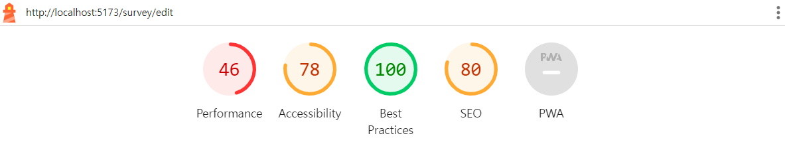
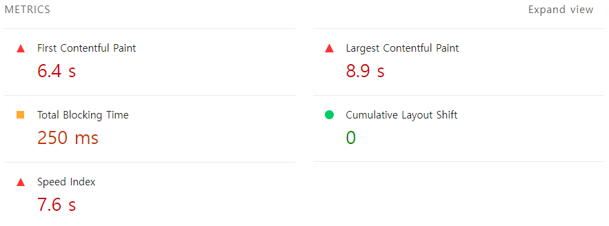
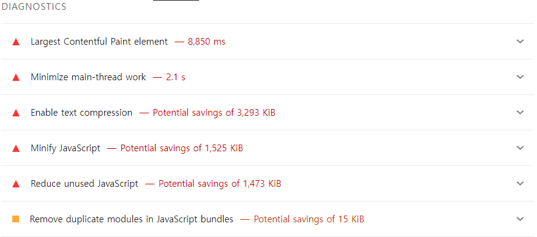
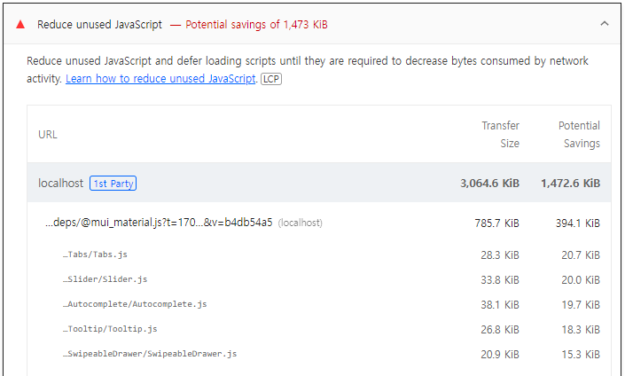
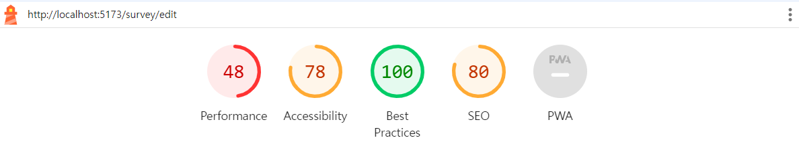
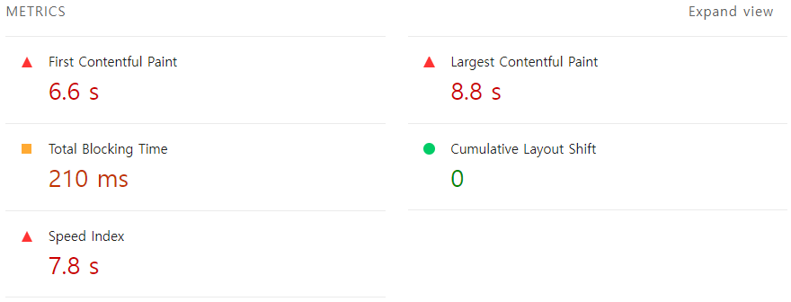
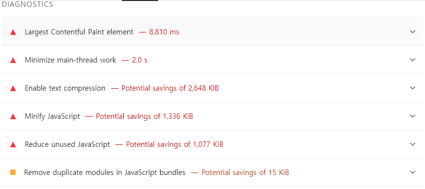
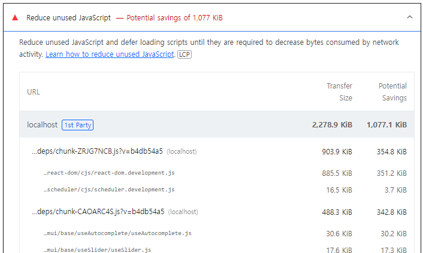

### 🔹 MUI Bundle Size 최소화

> 참고: [Minimizing bundle size](https://mui.com/material-ui/guides/minimizing-bundle-size/)

위 참고 링크를 들어가 공식 문서를 읽어보면 `mui` 라이브러리를 사용해서 컴포넌트를 import할 때, 아래처럼 `Named Import`를 하면 `Default Import`할 때보다 6배 더 늦은 startup times를 일으킬 수 있다고 한다.

```js
// 🐌 Named
import { Delete } from "@mui/icons-material";
```

```js
// 🚀 Default
import Delete from "@mui/icons-material/Delete";
```

ES6 module을 사용하고 tree-shaking을 지원하는 bundler(`webpack >= 2.x`, `parcel with a flag`)의 경우, `Named Import`를 해도 자동으로 bundle size를 최적화할 수 있다고 한다. `create-react-app`의 경우 webpack을 사용하고 있으므로 아마 제대로 tree-shaking이 적용되어 최적화된 bundle size를 만들 수 있겠지만, 이 프로젝트에선 `vite`를 사용했기 때문에 tree-shaking이 제대로 적용되었는지 확신할 수 없었다. 따라서, lighthouse를 사용해 성능 분석을 해보았더니 아래와 같이 'Reduce unused JavaScript'에서 사용하지도 않은 mui component들이 bundler에 포함되어 있음을 알 수 있었다.

 </br >
 </br >
 </br >
 </br >
👉 기존 SurveyEditPage에서 lighthouse 성능 측정 결과

Bundle Size를 최소화하기 위해 공식 문서에 따라 `Named Import`를 전부 `Default Import`로 변환시켜 주었다. 그 결과, 아래처럼 'Reduce unused JavaScript'에서 Transfer Size 크기가 3,064.6KiB에서 2,278.9KiB로 감소하고, 'Total Blocking Time' 값이 250ms에서 210ms로 감소하면서 Performance가 46%에서 48%로 증가한 것을 확인할 수 있었다. 비록, 성능 향상 정도는 미미했지만 그래도 위 과정을 통해 bundle size 최적화에 기여할 수 있었다.

 </br >
 </br >
 </br >
 </br >
👉 `Default Import`로 변환 후, SurveyEditPage에서 lighthouse 성능 측정 결과
