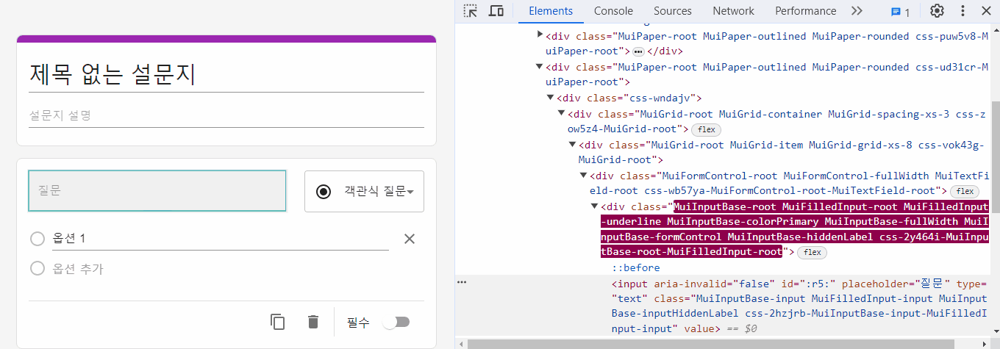
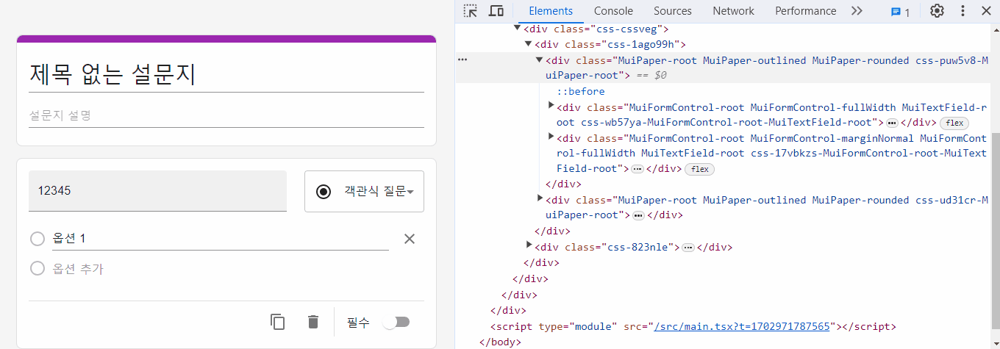

### 🔹 SurveyEditPageTitleBox 내 제목 입력창에 값 하나 입력할 때마다 outfocusing 되는 문제

설문조사 수정 페이지에서 설문조사 제목 박스 내 제목 입력창에 값을 하나 입력할 때마다 아웃포커싱되는 이슈가 발생했다.

아래 SurveyEditPageQuestionBox 내 입력창에 값을 입력할 때는 이러한 아웃포커싱 문제가 발생하지 않았는데, 대체 왜 SurveyEditPageTitleBox에선 이런 이슈가 발생한 걸까..? 그 이유를 알기 위해 SurveyEditPageQuestionBox와 SurveyEditPageTitleBox의 차이점을 파악하고자 했다.

일단, 두 컴포넌트의 첫 번째 차이점은 SurveyEditPageQuestionBox의 경우 redux store의 state 값을 props로 받는 반면, SurveyEditPageTitleBox의 경우 이 컴포넌트 내에서 useSelector 훅을 통해 바로 redux store의 state 값을 받게 된다. 하지만, props가 변경되어 리렌더링되나 useSelector에 의해 리렌더링되나 리액트는 어차피 변경된 가상돔 요소만 실제돔에 반영하기 때문에, 이러한 이유로 아웃포커싱되는 이슈가 발생할 것 같진 않았다.

혹시 SurveyEditPageTitleBox에서 제목 입력창에 값을 입력할 때마다 기존 컴포넌트가 리렌더링되는게 아니라 새로운 컴포넌트가 만들어지는건 아닐까싶어 개발자 검사 도구의 element 탭 부분을 확인해보았다. 확인한 결과, 아래처럼 제목 입력창에 값을 입력할 때마다 SurveyEditPageTitleBox의 div 요소에 보라색 배경이 생기면서 새로 생성됨을 알 수 있었다.

 </br >
👉 SurveyEditPageQuestionBox의 title 입력창을 수정하는 경우

 </br >
👉 SurveyEditPageTitleBox의 title 입력창을 수정하는 경우

대체 왜 두 컴포넌트가 이러한 차이를 보이는 걸까? SurveyEditPageTitleBox가 렌더링하는 요소 중 하위 요소를 감싸는 SurveyTitleBox 컴포넌트를 주목하게 되었다. SurveyTitleBox 컴포넌트를 보면 컴포넌트 내 `styled(Box)`를 통해 emotion으로 새로운 컴포넌트를 만들어주는 것을 확인할 수 있었다. 혹시, SurveyTitleBox가 리렌더링될 때마다 `styled(Box)`을 호출해 새로운 컴포넌트를 만들게 되고 이로 인해 SurveyTitleBox를 사용하고 있는 SurveyEditPageTitleBox가 리렌더링될 때마다 새로운 돔요소가 만들어지고 있는 걸까라는 의심이 들었다.

그래서 한번 `styled(Box)` 코드를 SurveyTitleBox 컴포넌트 밖으로 꺼내본 후, 제목 입력창에 값을 입력해보았다. 그랬더니 아웃포커싱되는 이슈가 없어지는 것을 확인할 수 있었다. 이러한 이유였다니... 허망한 감정과 동시에 드디어 해결했다는 뿌듯함이 밀려왔다.

내가 생각한 이유가 맞는지 한번 더 확인하기 위해, 이번엔 `styled(Box)` 코드를 SurveyTitleBox 컴포넌트 밖으로 꺼내지 않고 아래처럼 `useMemo`를 사용해 `styled(Box)` 코드를 감싸 이전 컴포넌트를 기억하도록 했다. 이 방법 또한 아웃포커싱되는 이슈를 해결해주었다.

```js
function SurveyTitleBox({ children }: SurveyTitleBoxProps) {
  const theme = useTheme();

  const StyledBox = useMemo(
    () => styled(Box)`
      position: relative;
      padding-top: ${BOX_PADDING * DEFAULT_PADDING_UNIT + BAR_HEIGHT}px;

      &::before {
        content: "";
        display: block;
        position: absolute;
        top: 0;
        left: 0;
        width: 100%;
        height: ${BAR_HEIGHT}px;
        border-radius: ${BAR_BORDER_RADIUS}px ${BAR_BORDER_RADIUS}px 0 0;
        background-color: ${theme.palette.secondary.main};
      }
    `,
    []
  );

  return <StyledBox>{children}</StyledBox>;
}
```
