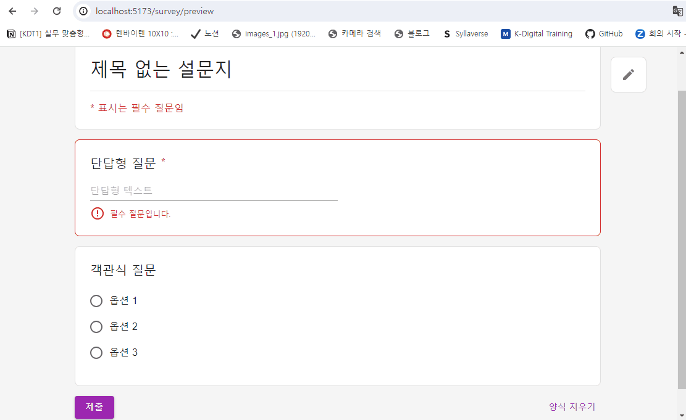
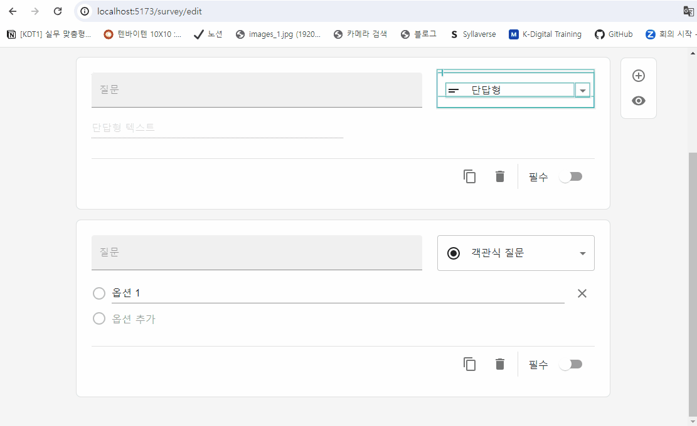
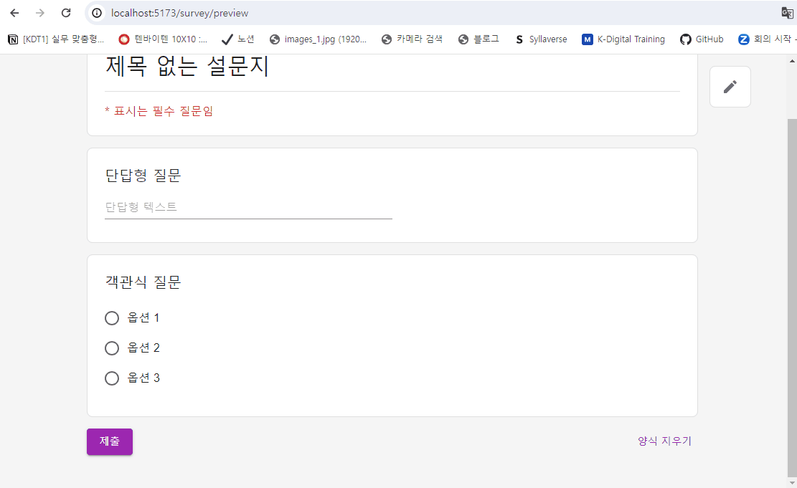

### 🔹 렌더링 성능 개선

> 참고: [`React.memo()` 현명하게 사용하기](https://ui.toast.com/weekly-pick/ko_20190731)

개발자 검사 도구에서 profiler 탭의 'Highlight updates when components render.' 설정을 키면, 특정 question box의 입력창에 값을 입력할 때마다 페이지 내 다른 question box 컴포넌트들이 리렌더링되는 것을 확인할 수 있었다.

 </br >

👉 기존 SurveyEditPageQuestionBox의 입력창에 값을 입력할 경우

 </br >
👉 기존 SurveyPreviewPageQuestionBox의 입력창에 값을 입력할 경우

모든 question box 내 데이터들을 redux store로 관리하다보니 입력값을 변경할 때마다 redux store로 새 입력값을 dispatch 보내게 되고 store 값이 변경되면 해당 state를 사용하는 컴포넌트(`SurveyEditPageQuestionList`, `SurveyPreviewPageQuestionList`)가 리렌더링되면서 하위 모든 question box들이 리렌더링되는 것이다.

```js
// SurveyEditPageQuestionList 컴포넌트 (축약한 형태)
import { SurveyEditPageQuestionBox } from "@components";

function SurveyEditPageQuestionList() {
  const questions = useSelector((state: RootState) => state.survey.questions);

  return (
    <>
      {questions.map((question, idx) => {
        return <SurveyEditPageQuestionBox data={question} />;
      })}
    </>
  );
}

export default SurveyEditPageQuestionList;
```

위처럼 해당 question box가 아닌 다른 question box들도 불필요하게 리렌더링되는 것을 보고 개선해야할 필요성을 느꼈다. 어떻게 효율적으로 렌더링할 수 있을까 고민하다가 `React.memo()` 함수를 사용해 기존 컴포넌트를 메모이제이션하는 방법을 떠올렸다. `React.memo()` 함수를 사용해 컴포넌트를 감싸게 되면, 현재 props와 이전 props를 비교해 같은 경우 기존 컴포넌트를 재사용하게 되면서 렌더링 효율성을 높일 수 있다.

 </br >
👉 SurveyEditPageQuestionBox에 `React.memo()`를 적용한 후

 </br >
👉 SurveyPreviewPageQuestionBox에 `React.memo()`를 적용한 후
